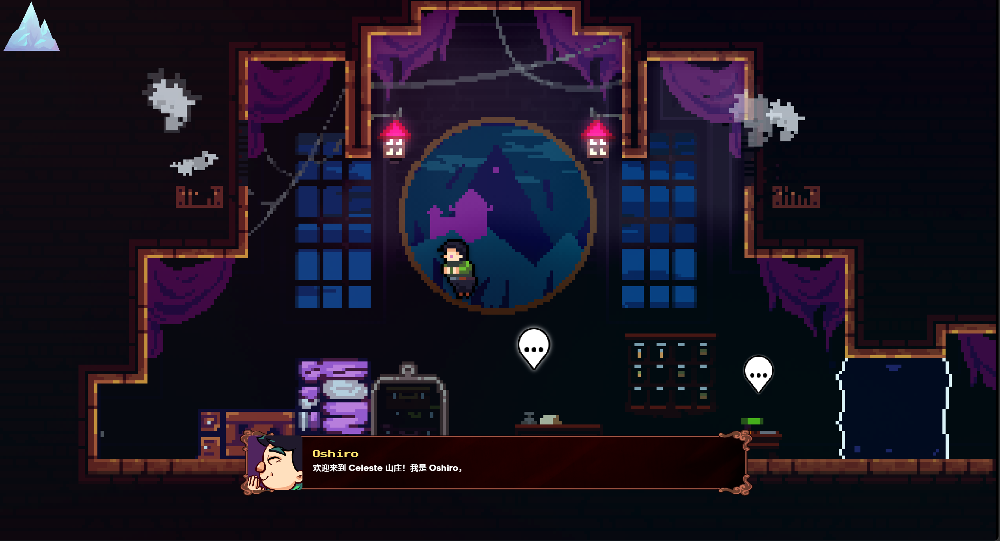
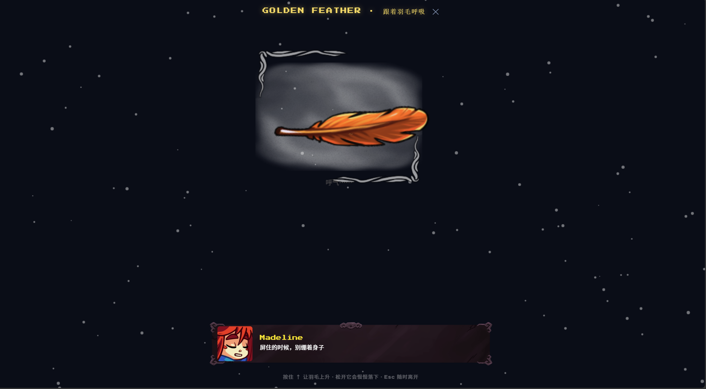
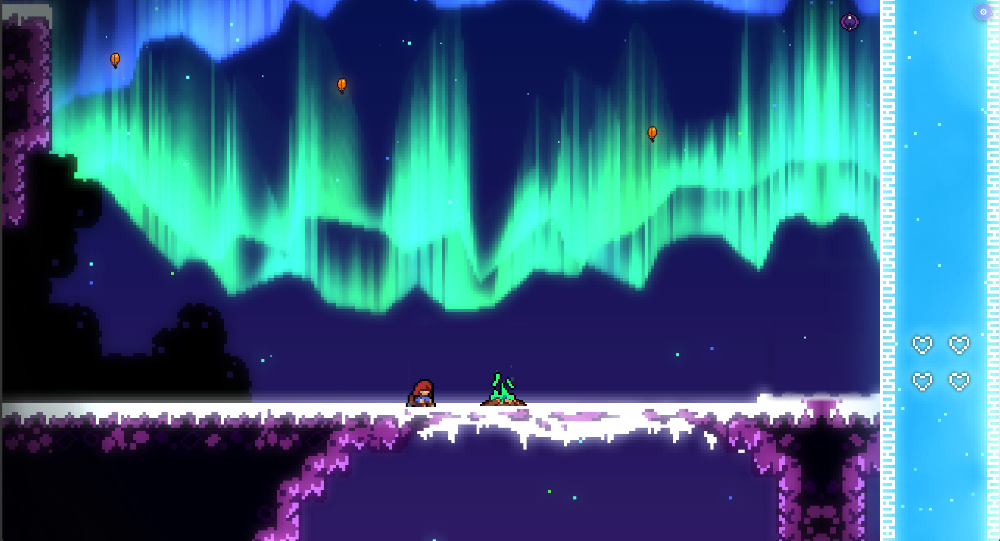
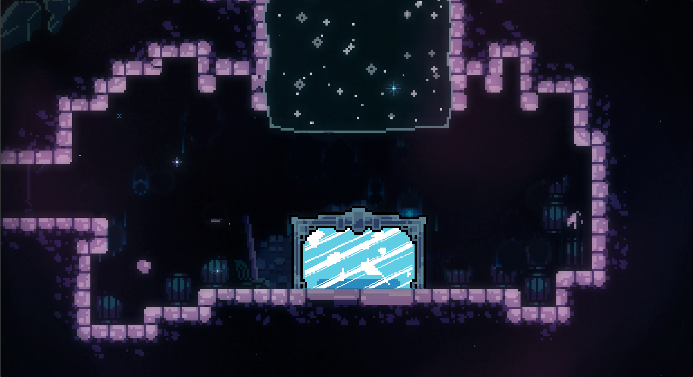

<div align="center">

<!-- ═══════════════════ HERO BANNER ═══════════════════ -->


<br>


#  AI Diary Companion Blog

> *"Every step up the mountain is a word in your story."*
> **让每一个字都有温度，让每一天都有意义。**

[](https://www.oracle.com/java/)
[](https://spring.io/projects/spring-boot)
[](https://developer.mozilla.org/docs/Web/JavaScript)
[](https://siliconflow.cn/)
[](LICENSE)
[-orange.svg?style=for-the-badge)](pom.xml)

</div>

---

## 🌐 Quick Links

| 🚀 Live Demo | 🎥 Demo Video | 📚 Docs |
|:---:|:---:|:---:|
| [**instapix.icu**](https://instapix.icu) | [**Bilibili**](https://www.bilibili.com/video/BV13QYT64EDX/) | [Contributing](CONTRIBUTING.md) · [Troubleshooting](TROUBLESHOOTING.md) |

> 🌤️ **Deployment Stack**: Frontend → Cloudflare Pages · Backend → Render (Docker) · Database → TiDB Cloud (Starter Free)

---

## 📖 Table of Contents

- [💫 The Vision](#-the-vision)
- [✨ Core Features](#-core-features)
- [🖼️ Screenshots Gallery](#️-screenshots-gallery)
- [🪶 Golden Feather System](#-golden-feather-system)
- [🪞 Dream Mirror & Badeline](#dream-mirror--badeline)
- [🏗️ System Architecture](#️-system-architecture)
- [📁 Project Structure](#-project-structure)
- [🚀 Quick Start](#-quick-start)
- [⚙️ Configuration Deep-Dive](#️-configuration-deep-dive)
- [🎯 Core Features Explained](#-core-features-explained)
- [📚 Technical Deep-Dive](#-technical-deep-dive)
- [🧪 Testing & Quality](#-testing--quality)
- [📦 Deployment Guide](#-deployment-guide)
- [🤝 Contribution Guide](#-contribution-guide)
- [❓ FAQ & Troubleshooting](#-faq--troubleshooting)
- [📈 Roadmap](#-roadmap)
- [📄 License & Acknowledgments](#-license--acknowledgments)

---

## 💫 The Vision

> *In Celeste, Madeline climbs a mountain to confront her anxiety.*
> *Here, you climb your own mountain — one diary entry at a time.*

The **Celeste AI Diary Companion Blog** is a dual-platform system that merges **private AI-assisted diary writing** with **optional public blog sharing**. Inspired by the indie masterpiece *Celeste* (Extremely OK Games), every pixel, sound, and interaction is themed around Madeline's journey to the summit.

Write your diaries here, and **Madeline** — warm, sincere, delicate — will be your constant climbing companion: offering writing feedback, proactive check-ins, cozy chats, feather-breathing gameplay, daily postcards, and bookshelf snapshots. In the dream world behind the bookshelf lives **Badeline** — your sharp-tongued shadow self: shatter the mirror to summon her, talk through the night, and open the crystal **Heart Door**. The tsundere innkeeper **Oshiro** permanently resides in the shop.

This dual-platform flow creates meaning: **intimate personal reflections in the diary can evolve into thoughtful blog entries** when you choose to share your insights with the world.

> ⚠️ **Note**: This project runs on **free-tier services** (Render + TiDB Cloud + Upstash). Due to resource limits and cold-start sleep, the live experience may be **slower** than the demo video. Your patience is appreciated — every summit takes time. 🏔️

---

## ✨ Core Features

<div align="center">
  
</div>

| 🏷️ | Feature | Description | Status |
|:---:|---------|-------------|:---:|
|  | **AI Companionship** | Madeline provides intelligent, emotionally-aware interactions (7 emotion states) | ✅ |
|  | **Memory System** | Daily postcards & monthly snapshot reflections (RAG-powered) | ✅ |
|  | **Feather Breathing Game** | Physics-based falling feather for anxiety relief | ✅ |
|  | **Strawberry Economy** | Earn 🍓 through writing, spend in Oshiro's shop | ✅ |
| 🪞 | **Badeline Night Talk** | Shatter the mirror to summon your shadow self; 15 emotion portraits + emotion-driven voice sfx | ✅ |
| 🌙 | **Dream World** | Snow-night campfire & mirror room with smooth cinematic camera pan | ✅ |
| 💎 | **Crystal Heart Door** | Split-open heart door, star-dust burst, crystal-heart ceremony | ✅ |
| 📝 | **Private Diary Writing** | Secure, formatted text with auto-save & AI feedback | ✅ |
| 🌐 | **Public Blog Sharing** | Transform diary entries into blog posts with one click | ✅ |
| 🔄 | **Diary → Blog Flow** | Seamless transition from private reflection to public sharing | ✅ |
| 👕 | **Customization** | Themes, decorations & personalization options | 🔄 |
| 📊 | **Analytics** | Emotion tracking, writing insights & engagement metrics | 🔄 |
| 🔒 | **Security Hardened** | BCrypt, JWT env-config, bounded pools, magic-number uploads | ✅ |
| 📈 | **Observability Ready** | Actuator + Prometheus metrics, structured logging, health probes | ✅ |

---

## 🖼️ Screenshots Gallery

### 🔐 Login — *"This is Madeline. Let's climb together."*

<p align="center">
  
</p>

The gateway to your climbing journey — a parchment-textured card floats on a starry night sky, Madeline's avatar greets you at the top.

### 🏠 Index — *Where your reflections become stories worth sharing.*

<p align="center">
  
</p>

The public blog hub — elegant dark cards with metadata, category filters (`All` / `Tech` / `Life` / `Study`), search bar, **Popular** posts and **Tags** cloud.

### 📖 Diary — *Every word has warmth, every day has meaning.*

<p align="center">
  
</p>

The heart of the app — a postcard-style diary reader where Madeline presents your past entries as mailed letters (stamps & postmarks included), with real-time companionship in a Celeste dialogue box.

### 🌟 My Space — *Your personal summit — every step counted.*

<p align="center">
  
</p>

A character-themed profile dashboard against Celeste's rocky backdrop — ticket-card with collected stickers, and a stats panel tracking **strawberry** 🍓, **cassette** 📼, and **chili** 🌶️ balances.

### ✍️ Write — *From private thoughts to public stories — one Publish away.*

<p align="center">
  
</p>

A full Markdown editor under a dreamy purple twilight sky — toolbar supports rich formatting plus **Madeline** refs, **润色/Polish** (AI refinement), and **生成文章/Generate**.

### 🏪 Shop — *Oshiro's Strawberry Inn — the tsundere innkeeper awaits.*

<p align="center">
  
</p>

Oshiro's cozy inn — pixel-perfect Celeste interior with purple curtains, campfire chimneys curling smoke, and the sharp-tongued innkeeper herself. Spend your 🍓 strawberries on decorations, chat with Oshiro, and explore the resort.

---

## 🪶 Golden Feather System

<p align="center">
  
</p>

A dual-core healing module inspired by *Celeste*: **Reflective Journaling** + **Anxiety Relief**.

| Module | How it works |
|:---:|---------|
| 📝 **Reflective Journaling** | Write scattered thoughts freely — Madeline listens warmly to untangle your mind. |
| 🌬️ **Anxiety Relief** | Follow the physics-based falling feather to breathe deeply and cool down when anxiety hits. |

**🎯 Workflow:** `Awareness (Write)` ➔ `Relief (Breathe)` ➔ `Reward (Get Feather)` ➔ `Restart`

> *Let every reflection be heard, and every anxiety find an exit.*

---

### 🌙 Dream Scene — *Behind the bookshelf — snow night, aurora, and a sleeping Madeline.*

<p align="center">
  
</p>

Enter the dream world by clicking the campfire behind the bookshelf. Madeline sleeps by the flickering flames while the **aurora** dances above — golden feather transformation balls float in the sky for reflective journaling. A cinematic camera pan carries you into the mirror room.

### 🪞 Mirror Room — *Purple space, shattered glass, and the shadow within.*

<p align="center">
  
</p>

The camera slides into a purple-brick mirror room. A **framed mirror** stands at the center — click it to shatter the glass, summon **Badeline**, and start your night talk. Crystalline particles drift through the void; a crystal **Heart Door** awaits behind you.

---

## 🪞 Dream Mirror & Badeline

Behind the bookshelf lies a **two-part dream world** — a snow-night campfire on the left and a purple mirror room on the right, joined by a cinematic one-viewport camera pan. Click the mirror to **shatter it** and summon **Badeline**, the part of you that is sharp, honest, and over-protective.

| 🎮 | Element | How it works |
|:---:|---------|--------------|
| 🌙 | **Dream Scene** | Snow-night campfire + mirror room on a 200vw stage; smooth horizontal camera pan |
| 🪞 | **Mirror Shatter** | Click to crack & shatter (WebAudio sfx); the break persists across visits |
| 🎭 | **15 Emotion Portraits** | AI tags each line with one of 15 states; frame-by-frame pixel portrait animation |
| 🔊 | **Emotion Voice SFX** | Real voice samples matched to emotion (see below) |
| 🚶 | **Free-roam Behavior Tree** | Badeline wanders, looks up, sleeps, plays dead — with idle/move state machine |
| 💎 | **Crystal Heart Door** | White flash → door splits → star-dust burst → crystal-heart ceremony |

### 🔊 Emotion-driven Voice System

A dedicated utility [`badeline-voice.js`](blog-ui/js/badeline-voice.js) (`window.BadelineVoice`) plays real voice samples, keeping the same style/pacing as Madeline's voice in the diary page:

- **Emotion map** is built from the folder names under `badeline-sounds/` — 10 loopable emotions (`normal`, `angry`, `concerned`, `freak`, `scoff`, `serious`, `skeptical`, `upset`, `worried`, `yell`)
- **`pre` + `abcabc` loop**: each sentence opens with the `per` (pre) sample, then cycles `mid_A → mid_B → mid_C`, each step randomly picking one of 10 numbered clips
- **Playback rate & volume** shift per emotion; the typewriter triggers one blip every 3 characters — identical pacing to Madeline
- **`sad_solo`**: a single standalone clip on its own channel, triggered **only** when the AI detects the special deep-sorrow emotion (`sad`); it never enters the loop

> 🎙️ *Audio unlocks after your first click/keypress (browser autoplay policy).*

---

## 🛡️ Disclaimer

This project is an **unofficial, non-commercial fan project** for learning and exchange only.
Celeste-related art, characters, music, and fonts belong to **Extremely OK Games (Maddy Makes Games)**.
If the copyright holder requests removal, relevant content will be removed immediately.

---

## 🏗️ System Architecture

```
┌─────────────────────────────────────────────────────────────────────────────┐
│                        CELESTE BLOG ECOSYSTEM                              │
├─────────────────────────────────────────────────────────────────────────────┤
│                                                                             │
│  ┌──────────────────┐      ┌──────────────────┐      ┌──────────────────┐  │
│  │   blog-ui/       │      │   blog-api/      │      │  blog-admin/     │  │
│  │  (Frontend)      │◄────►│  (Core API)      │◄────►│  (Admin Panel)   │  │
│  │  Vanilla HTML/   │ REST │  Spring Boot     │      │  Spring Boot +   │  │
│  │  CSS/JS          │      │  2.5.0 + MP      │      │  Spring Security │  │
│  │  Port: 8080      │      │  Port: 8888      │      │  Port: 8889      │  │
│  └──────────────────┘      └────────┬─────────┘      └──────────────────┘  │
│                                     │                                      │
│                    ┌────────────────┼────────────────┐                     │
│                    │                │                │                     │
│              ┌─────▼─────┐    ┌─────▼─────┐    ┌─────▼─────┐             │
│              │  MySQL    │    │   Redis   │    │ SiliconFlow│             │
│              │  (blog)   │    │  (Cache/  │    │  (GLM-4 +  │             │
│              │  :3306    │    │  Session/ │    │  bge-m3)   │             │
│              │           │    │  Token)   │    │  AI Gateway│             │
│              └───────────┘    └───────────┘    └─────────────┘             │
│                                                                             │
└─────────────────────────────────────────────────────────────────────────────┘
```

### Tech Stack Summary

| Layer | Technology | Version | Purpose |
|-------|------------|---------|---------|
| **Language** | Java | 17 LTS | Type-safe, performant backend |
| **Framework** | Spring Boot | 2.5.0 | Convention-over-configuration |
| **ORM** | MyBatis-Plus | 3.5.3.1 | Enhanced MyBatis with CRUD, pagination |
| **Security** | Spring Security + JWT | 5.x / 0.9.1 | Stateless auth, BCrypt passwords |
| **Cache/Session** | Redis + Lettuce | 6.x | Distributed cache, token store |
| **AI Gateway** | SiliconFlow | — | GLM-4 (chat), bge-m3 (embedding) |
| **Database** | MySQL | 5.7+/8.0 | Primary persistence |
| **Monitoring** | Actuator + Micrometer + Prometheus | 2.5.x / 1.10+ | Metrics, health checks |
| **Build** | Maven | 3.6+ | Multi-module build |
| **Frontend** | Vanilla HTML/CSS/JS | ES6+ | Zero-build, framework-free |
| **Fonts** | Renogare + CelesteZH | — | Pixel-perfect Celeste aesthetic |

---

## 📁 Project Structure

```
blog/
├── pom.xml                              # Parent POM (dependency management)
├── README.md                            # This file
├── CONTRIBUTING.md                      # Contribution guidelines
├── LICENSE                              # MIT License
├── TROUBLESHOOTING.md                   # Detailed troubleshooting guide
├── blog-api/                            # Core backend module
│   ├── pom.xml
│   └── src/main/
│       ├── java/com/mszlu/blog/
│       │   ├── config/                  # Configuration classes
│       │   │   ├── ThreadPoolConfig.java     # Bounded async executor
│       │   │   ├── WebMVCConfig.java         # CORS, interceptors
│       │   │   └── MybatisPlusConfig.java    # MP plugins, ID generator
│       │   ├── controller/              # REST endpoints
│       │   │   ├── ArticleController.java    # Blog articles
│       │   │   ├── CategoryController.java   # Categories
│       │   │   ├── ChatController.java       # AI chat
│       │   │   ├── CommentsController.java   # Comments
│       │   │   ├── DiaryController.java      # Diary entries
│       │   │   ├── FeatherController.java    # Feather game
│       │   │   ├── LikeController.java       # Likes
│       │   │   ├── LoginController.java      # Auth (JWT)
│       │   │   ├── LogoutController.java     # Logout
│       │   │   ├── MemoryController.java     # RAG memory
│       │   │   ├── NotificationController.java # Notifications
│       │   │   ├── PersonaController.java    # AI personas
│       │   │   ├── ProactiveController.java  # Proactive AI
│       │   │   ├── RegisterController.java   # Registration
│       │   │   ├── TagsController.java       # Tags
│       │   │   ├── UploadController.java     # File upload (magic-number validated)
│       │   │   └── UserController.java       # User profile
│       │   ├── dao/
│       │   │   ├── mapper/                # MyBatis mappers
│       │   │   ├── pojo/                  # Entity classes
│       │   │   └── dos/                   # Data objects for complex queries
│       │   ├── handler/
│       │   │   ├── AllExceptionHandler.java    # Global exception handling
│       │   │   └── LoginIntercepter.java       # JWT auth interceptor
│       │   ├── impl/                    # Service implementations
│       │   ├── service/                 # Service interfaces
│       │   │   └── ai/
│       │   │       ├── AiClient.java           # GLM-4 client (JSON mode)
│       │   │       ├── PromptBuilder.java      # Centralized prompt engineering
│       │   │       └── MemorySearchService.java
│       │   ├── utils/
│       │   │   ├── JWTUtils.java               # JWT create/verify (env-configurable)
│       │   │   └── UserThreadLocal.java        # Thread-local user context
│       │   ├── vo/                      # View objects (API contracts)
│       │   └── common/
│       │       ├── aop/                        # Method-level audit logging
│       │       └── cache/                      # Redis caching AOP
│       └── resources/
│           ├── application.properties        # Dev config
│           ├── application-prod.yml          # Production config (HikariCP, security headers)
│           └── log4j2.xml                    # Structured JSON logging
├── blog-admin/                          # Admin backend module
│   └── src/main/java/com/mszlu/blog/admin/
│       ├── config/SecurityConfig.java         # Spring Security form login + RBAC
│       ├── controller/                        # Admin endpoints
│       ├── service/AuthService.java           # URL-level permission check
│       └── ...
└── blog-ui/                             # Frontend static assets
    ├── index.html                       # Blog index
    ├── diary.html                       # Diary main page
    ├── write.html                       # Writing editor (Markdown + AI tools)
    ├── shelf.html                       # Dream world: Heart Door & Badeline
    ├── shop.html                        # Oshiro Inn (strawberry economy)
    ├── me.html                          # Personal space
    ├── archives.html / article.html     # Blog archives & detail
    ├── login.html / register.html       # Auth pages
    ├── badeline-sounds/                 # Badeline voice clips (10 emotions + sad_solo)
    ├── css/  js/  celeste-gui/  celeste-sounds/  celeste-font-en/ ...
```

---

## 🚀 Quick Start

### Prerequisites

- **Java 17+** (JDK 17 LTS recommended)
- **Maven 3.6+**
- **MySQL 5.7+ / 8.0**
- **Redis 6+** (caching & token storage)
- **SiliconFlow API Key** (GLM-4 & bge-m3)
- **Node.js 18+** (optional, for frontend dev server)

### 1. Clone & Configure

```bash
git clone <repository-url>
cd blog

# Create database
mysql -u root -p -e "CREATE DATABASE blog CHARACTER SET utf8mb4 COLLATE utf8mb4_unicode_ci;"
```

### 2. Environment Variables

Create `.env` or export in shell:

```bash
# === Security (MUST CHANGE IN PROD) ===
export JWT_SECRET="$(openssl rand -base64 48)"
export MYSQL_PASSWORD="your_strong_db_password"
export REDIS_PASSWORD="your_redis_password"

# === External Services ===
export QINIU_ACCESS_KEY="your_qiniu_ak"
export QINIU_SECRET_KEY="your_qiniu_sk"
export AI_API_KEY="your_siliconflow_api_key"
export AI_BASE_URL="https://api.siliconflow.cn/v1"
export AI_MODEL="THUDM/GLM-4-9B-0414"
export AI_EMBEDDING_MODEL="BAAI/bge-m3"

# === Database (if not localhost) ===
export MYSQL_HOST="your_mysql_host"
export MYSQL_PORT="3306"
export MYSQL_USERNAME="root"
export REDIS_HOST="your_redis_host"
export REDIS_PORT="6379"
```

> **Development**: `application.properties` has defaults; only `JWT_SECRET` is mandatory to override.

### 3. Build & Run Backend

```bash
# From project root
mvn clean install -DskipTests

# Run API module (port 8888)
cd blog-api
mvn spring-boot:run -Dspring-boot.run.profiles=dev
```

### 4. Run Admin (Optional)

```bash
cd ../blog-admin
mvn spring-boot:run -Dspring-boot.run.profiles=dev   # Port 8889
```

### 5. Serve Frontend

```bash
cd ../blog-ui
python3 -m http.server 8080        # Option A: Python (simplest)
# npx serve .                      # Option B: Node.js
```

### 6. Access

| Page | URL |
|------|-----|
| Blog Home | http://localhost:8080/index.html |
| Diary | http://localhost:8080/diary.html |
| Write | http://localhost:8080/write.html |
| Bookshelf | http://localhost:8080/shelf.html |
| Shop (Oshiro) | http://localhost:8080/shop.html |
| My Space | http://localhost:8080/me.html |
| Archives | http://localhost:8080/archives.html |
| Login | http://localhost:8080/login.html |
| Admin Panel | http://localhost:8889/login.html |
| Actuator Health | http://localhost:8888/actuator/health |
| Prometheus Metrics | http://localhost:8888/actuator/prometheus |

---

## ⚙️ Configuration Deep-Dive

### Core Config (`blog-api/src/main/resources/application.properties`)

```properties
# Server
server.port=8888
spring.application.name=mszlu_blog
spring.profiles.active=dev

# Database
spring.datasource.url=jdbc:mysql://localhost:3306/blog?useUnicode=true&characterEncoding=UTF-8&serverTimeZone=UTC
spring.datasource.username=root
spring.datasource.password=${MYSQL_PASSWORD:your_password}
spring.datasource.driver-class-name=com.mysql.cj.jdbc.Driver

# MyBatis-Plus
mybatis-plus.configuration.log-impl=org.apache.ibatis.logging.stdout.StdOutImpl
mybatis-plus.global-config.db-config.table-prefix=ms_
mybatis-plus.mapper-locations=classpath*:com/mszlu/blog/dao/mapper/**/*.xml

# Upload limits
spring.servlet.multipart.max-request-size=20MB
spring.servlet.multipart.max-file-size=8MB

# Qiniu Cloud Storage
qiniu.accessKey=${QINIU_ACCESS_KEY:your-access-key}
qiniu.accessSecretKey=${QINIU_ACCESS_SECRET_KEY:your-secret-key}

# AI (SiliconFlow)
ai.base-url=${AI_BASE_URL:https://api.siliconflow.cn/v1}
ai.api-key=${AI_API_KEY:your-api-key}
ai.model=${AI_MODEL:THUDM/GLM-4-9B-0414}
ai.embedding-model=${AI_EMBEDDING_MODEL:BAAI/bge-m3}

# JWT (env-configurable)
jwt.secret=${JWT_SECRET:123456Mszlu!@###$$}
jwt.expiration=2592000000

# Actuator & Prometheus
management.endpoints.web.exposure.include=health,info,prometheus,metrics
management.endpoint.health.show-details=always
management.prometheus.metrics.export.enabled=true
```

### Production Config (`application-prod.yml`) — Key Hardening

```yaml
spring:
  datasource:
    hikari:
      maximum-pool-size: 20
      minimum-idle: 5
      idle-timeout: 300000
      max-lifetime: 1200000
      connection-timeout: 30000
  redis:
    lettuce:
      pool: { max-active: 20, max-idle: 10, min-idle: 2 }

server:
  headers:
    x-content-type-options: nosniff
    x-frame-options: DENY
    x-xss-protection: "1; mode=block"

springdoc:
  api-docs: { enabled: false }
  swagger-ui: { enabled: false }

logging:
  level: { root: INFO, com.mszlu.blog: INFO }
  file: { name: logs/blog-api.log, max-size: 100MB, max-history: 30 }
```

---

## 🎯 Core Features Explained

### 1. AI Companionship System

**Madeline** (GLM-4) — Warm, sincere, delicate personality:
- **Real-time chat** with streaming responses
- **Emotion analysis**: 7 valid states (default, cute, anxious, unhappy, surprised, resentful, speechless)
- **Proactive care**: Daily 9:30 AM check-in via `ThreadService` + cron
- **JSON mode**: Structured output `{reply, emotion, suggestions[]}`

**Oshiro** (Tsundere innkeeper) — Shop page exclusive, with `PromptBuilder.oshiroChat` and strawberry economy interactions.

**Badeline** (Shadow self) — Dream world behind the bookshelf:
- **Summon**: shatter the mirror (`/diary/badeline-chat`); the broken state persists and can be refreshed by the dream-mode reroll
- **15-state emotion system**: the AI prefixes each reply with `[emotion:xxx]`, driving both pixel portraits and the voice sfx
- **Night talk**: `/diary/dream-night-talk` lets her read and respond to a specific dream
- **Voice sfx**: the `badeline-voice.js` utility maps emotions to real clips (`pre+abcabc` loop, plus the one-shot `sad_solo`)

**RAG Memory** (bge-m3 embeddings):
- `MemoryServiceImpl.searchContext()` — Semantic search over diary history
- `ContextChunk{source, text, label, relevanceScore}` augmenting prompts
- Lazy-fill monthly snapshots via `snapReflect()`

### 2. Diary & Blog Flow

```
┌─────────────┐     ┌─────────────┐     ┌─────────────┐
│  Write      │────►│  Diary      │────►│  Publish    │
│  (Private)  │     │  (Saved)    │     │  (Public)   │
└─────────────┘     └─────────────┘     └─────────────┘
                           │                    │
                    ┌──────▼──────┐       ┌──────▼──────┐
                    │  AI Feedback│       │  Blog Feed  │
                    │  + Emotion  │       │  + Comments │
                    └─────────────┘       └─────────────┘
```

- **Diary**: Rich text, auto-save, emotion tagging, AI feedback during writing
- **Blog**: Markdown editor, categories, tags, cover images, SEO-friendly URLs
- **One-click publish**: Select diary entries → transform → blog post

### 3. Memory & Review System

| Feature | Trigger | Output |
|---------|---------|--------|
| Daily Postcard | 1+ entries/day | AI-generated visual postcard with stamp |
| Monthly Snapshot | ≥3 entries/7d OR ≥8 entries/30d | Madeline reflection + emotion timeline |
| Bookshelf View | On-demand | Card gallery of snapshots, exportable |

### 4. Interactive Elements

- **Feather Breathing Game**: Physics-based (gravity, wind, collision), precision landing scoring, `feather-landed` custom event
- **Strawberry Economy**: Earn 🍓 by writing, spend in Oshiro's shop for themes/decorations
- **Pixel Avatars**: 8-direction Madeline sprite with spatial audio

### 5. Security Hardening

| Area | Implementation |
|------|----------------|
| **Password Storage** | BCrypt (via `BCryptPasswordEncoder`) |
| **JWT Secret** | Externalized to `JWT_SECRET` env var, supports rotation |
| **Token Expiry** | 30 days (configurable via `jwt.expiration`) |
| **Thread Pool** | Bounded queue (1000), `CallerRunsPolicy` rejection |
| **File Upload** | Extension + MIME type + Magic number validation |
| **Dependencies** | Fastjson 1.2.101 (CVE fixes), MyBatis-Plus unified |
| **Observability** | Actuator health/info/prometheus, Prometheus export |

---

## 📚 Technical Deep-Dive

### Backend Service Layer

| Service | Key Responsibilities |
|---------|---------------------|
| `DiaryServiceImpl` | Diary CRUD, blog publishing, AI companion, summaries, snapshots, postcards, proactive bubbles |
| `ChatServiceImpl` | Main AI chat handler, JSON response parsing, emotion validation |
| `MemoryServiceImpl` | RAG: memory extraction, embedding, semantic search, context chunks |
| `LoginServiceImpl` | Auth: BCrypt verify, JWT issue, Redis token store, register |
| `ThreadService` | Async view-count updates (CAS retry), proactive message scheduling |
| `ArticleService` | Blog article CRUD, hot/new/archive lists, view counts |
| `CategoryService` / `TagService` | Taxonomy management |

### Frontend Architecture

```
blog-ui/
├── index.html          → Blog feed (category filter, search, popular, tags)
├── diary.html          → Postcard viewer + Madeline chat (~2400-line diary.js)
├── write.html          → Markdown editor + AI toolbar (Polish, Generate, Madeline)
├── shelf.html          → Dream world (Heart Door, mirror room, Badeline)
├── shop.html           → Oshiro Inn (dialogue, strawberry shop)
├── me.html             → Profile, stats, collection, settings
├── article.html        → Blog article detail (content, comments, likes)
├── archives.html       → Chronological archive
└── login/register.html → Auth pages (JWT token → localStorage)
```

**Key JS Modules**:
- `api.js` — Centralized fetch wrapper with auth interceptors, strawberry balance
- `diary.js` — Immersive typewriter, streaming AI, emotion UI, autosave, feather game integration
- `badeline-voice.js` — Badeline emotion voice: `pre+abcabc` loop, per-emotion rate/volume, `sad_solo` special
- `write-madeline.js` — 8-pose pixel avatar, resource optimizer, spatial audio
- `feather-game.js` — Physics engine, difficulty scaling, event system

---

## 🧪 Testing & Quality

### Current State
- Unit tests: Minimal (placeholder `spring-boot-starter-test` only)
- Integration tests: None
- Static analysis: None configured

### Recommended Additions (Testcontainers)

```xml
<!-- Parent pom.xml <dependencyManagement> -->
<dependency>
    <groupId>org.testcontainers</groupId>
    <artifactId>testcontainers-bom</artifactId>
    <version>1.19.0</version>
    <type>pom</type>
    <scope>import</scope>
</dependency>

<!-- blog-api/pom.xml -->
<dependency>
    <groupId>org.testcontainers</groupId>
    <artifactId>junit-jupiter</artifactId>
    <scope>test</scope>
</dependency>
<dependency>
    <groupId>org.testcontainers</groupId>
    <artifactId>mysql</artifactId>
    <scope>test</scope>
</dependency>
<dependency>
    <groupId>org.testcontainers</groupId>
    <artifactId>redis</artifactId>
    <scope>test</scope>
</dependency>
```

### CI/CD Pipeline (Suggested)

```yaml
# .github/workflows/ci.yml
name: CI
on: [push, pull_request]
jobs:
  build:
    runs-on: ubuntu-latest
    services:
      mysql:
        image: mysql:8.0
        env: { MYSQL_ROOT_PASSWORD: test, MYSQL_DATABASE: blog }
        ports: [3306:3306]
        options: --health-cmd="mysqladmin ping" --health-interval=10s
      redis:
        image: redis:7-alpine
        ports: [6379:6379]
    steps:
      - uses: actions/checkout@v4
      - uses: actions/setup-java@v4
        with: { distribution: 'temurin', java-version: '17' }
      - name: Cache Maven
        uses: actions/cache@v4
        with: { path: ~/.m2, key: maven-${{ hashFiles('**/pom.xml') }} }
      - run: mvn clean verify -B
      - name: SonarQube Scan
        uses: SonarSource/sonarqube-scan-action@v2
        env: { SONAR_TOKEN: ${{ secrets.SONAR_TOKEN }} }
```

---

## 📦 Deployment Guide

### Docker Compose (Recommended for Prod)

```yaml
# docker-compose.yml
version: '3.8'
services:
  mysql:
    image: mysql:8.0
    environment:
      MYSQL_DATABASE: blog
      MYSQL_ROOT_PASSWORD: ${MYSQL_PASSWORD}
    volumes: [ mysql_data:/var/lib/mysql ]
    healthcheck:
      test: ["CMD", "mysqladmin", "ping", "-h", "localhost"]
      interval: 10s
      timeout: 5s
      retries: 5

  redis:
    image: redis:7-alpine
    command: redis-server --requirepass ${REDIS_PASSWORD}
    volumes: [ redis_data:/data ]
    healthcheck:
      test: ["CMD", "redis-cli", "ping"]
      interval: 10s

  blog-api:
    build: ./blog-api
    ports: ["8888:8888"]
    environment:
      SPRING_PROFILES_ACTIVE: prod
      MYSQL_HOST: mysql
      REDIS_HOST: redis
      JWT_SECRET: ${JWT_SECRET}
      QINIU_ACCESS_KEY: ${QINIU_ACCESS_KEY}
      QINIU_SECRET_KEY: ${QINIU_SECRET_KEY}
      AI_API_KEY: ${AI_API_KEY}
    depends_on:
      mysql: { condition: service_healthy }
      redis: { condition: service_healthy }
    restart: unless-stopped

  blog-admin:
    build: ./blog-admin
    ports: ["8889:8889"]
    environment:
      SPRING_PROFILES_ACTIVE: prod
      MYSQL_HOST: mysql
    depends_on:
      mysql: { condition: service_healthy }
    restart: unless-stopped

  nginx:
    image: nginx:alpine
    ports: ["80:80", "443:443"]
    volumes:
      - ./nginx.conf:/etc/nginx/nginx.conf:ro
      - ./blog-ui:/usr/share/nginx/html:ro
    depends_on: [blog-api, blog-admin]
    restart: unless-stopped

volumes:
  mysql_data:
  redis_data:
```

**Nginx Config** (serves frontend + reverse proxies API):

```nginx
events { worker_connections 1024; }
http {
  upstream api   { server blog-api:8888; }
  upstream admin { server blog-admin:8889; }

  server {
    listen 80;
    server_name your-domain.com;
    return 301 https://$server_name$request_uri;
  }

  server {
    listen 443 ssl http2;
    server_name your-domain.com;
    ssl_certificate     /etc/ssl/certs/cert.pem;
    ssl_certificate_key /etc/ssl/private/key.pem;

    location / {
      root /usr/share/nginx/html;
      try_files $uri $uri/ /index.html;
    }
    location /api/ {
      proxy_pass http://api;
      proxy_set_header Host $host;
      proxy_set_header X-Real-IP $remote_addr;
      proxy_set_header X-Forwarded-For $proxy_add_x_forwarded_for;
      proxy_set_header X-Forwarded-Proto $scheme;
    }
    location /admin/ {
      proxy_pass http://admin;
      proxy_set_header Host $host;
      proxy_set_header X-Real-IP $remote_addr;
    }
    location /actuator/ {
      allow 10.0.0.0/8;
      deny all;
      proxy_pass http://api;
    }
  }
}
```

### Kubernetes (Helm) — Sketch

```yaml
# helm/values.yaml (key configs)
blog-api:
  replicaCount: 3
  resources:
    limits:   { cpu: "1000m", memory: "1Gi" }
    requests: { cpu: "500m",  memory: "512Mi" }
  autoscaling:
    enabled: true
    minReplicas: 3
    maxReplicas: 10
    targetCPUUtilization: 70
  env:
    - name: JWT_SECRET
      valueFrom: { secretKeyRef: { name: blog-secrets, key: jwt-secret } }
    - name: MYSQL_PASSWORD
      valueFrom: { secretKeyRef: { name: blog-secrets, key: mysql-password } }
blog-admin: { replicaCount: 2 }
nginx:      { replicaCount: 2 }   # TLS via cert-manager + Let's Encrypt
```

---

## 🤝 Contribution Guide

We welcome contributions! Please read [CONTRIBUTING.md](CONTRIBUTING.md) first.

### Quick Contribution Flow

```bash
git clone https://github.com/your-username/blog.git
cd blog
git checkout -b feature/your-feature-name
# make changes
mvn clean test -pl blog-api,blog-admin
git commit -m "feat(diary): add emotion trend chart to monthly snapshot"
git push origin feature/your-feature-name
# Open PR against main branch
```

### Coding Standards (Iron Laws from AI Handover)

1. **Verify Before Trust** — After any fix, re-read the file to confirm actual state
2. **No Placeholder Comments** — Never write `// ... existing code ...` in real files
3. **Complete Replacement** — When replacing functions, ensure old code is fully removed
4. **JS Modification Standard** — Provide complete code block + precise line numbers
5. **Fonts** — All text: **Renogare + CelesteZH**; only `#gameDialogName` uses Press Start 2P
6. **Asset Paths** — `celeste-sounds/madeline/...` includes `madeline/` layer
7. **GIF/Pixel Art** — No canvas scanning for size; use fixed pixel values
8. **Commit Messages** — Conventional Commits: `type(scope): description`

### Code Quality Gates (CI)

| Check | Tool | Threshold |
|-------|------|-----------|
| Compile | Maven | Zero errors |
| Unit Tests | JUnit 5 | ≥ 70% coverage (target) |
| Integration Tests | Testcontainers | All pass |
| Static Analysis | SpotBugs + Checkstyle | Zero critical/high |
| Dependency Scan | OWASP Dependency-Check | Zero CVE ≥ High |
| SonarQube | SonarCloud | Quality Gate pass |

---

## ❓ FAQ & Troubleshooting

### General

| Question | Answer |
|----------|--------|
| **What is this project?** | Immersive AI diary + blog platform with Celeste theme |
| **Do I need coding skills to use?** | No — end-user ready; coding only for dev/customization |
| **Mobile support?** | Responsive, but optimized for desktop/tablet |
| **AI Models?** | GLM-4 (chat), bge-m3 (embeddings) via SiliconFlow |
| **Data privacy?** | MySQL storage; prod requires encryption, backups, access control |
| **Own AI key?** | Yes — set `AI_API_KEY` env var |

### Common Issues

| Symptom | Diagnosis Steps |
|---------|-----------------|
| Frontend feature not working | 1. Re-read file to confirm changes  2. Clear browser cache  3. Check console errors |
| Backend 404 | 1. Is port 8888 running?  2. Check `spring.servlet.context-path` |
| Compile "cannot find symbol" | 1. Check import path (e.g. `UserThreadLocal` in `utils` pkg) |
| Constructor mismatch | 1. `@AllArgsConstructor` field order = param order |
| Audio 404 | 1. Path missing `madeline/` layer (`celeste-sounds/madeline/...`) |
| Badeline voice silent | 1. First click/keypress unlocks audio  2. Confirm `badeline-sounds/` restored (10 dirs + `sad_solo`) |
| Emotion display broken | 1. AI response must be one of 7 valid values (else falls back to `default`) |
| `diarySaveCount` weird | 1. Check `localStorage` diary count logic |
| Feather game unresponsive | 1. Browser console for JS errors |
| Postcard generation fails | 1. Backend running?  2. Check logs for AI API errors |
| Prometheus empty | 1. `management.prometheus.metrics.export.enabled=true`  2. `/actuator/prometheus` accessible? |

> See [TROUBLESHOOTING.md](TROUBLESHOOTING.md) for an exhaustive guide.

---

## 📈 Roadmap

### Near Term (v1.1)
- [ ] Monthly snapshot lazy-fill verification + backend restart resilience
- [ ] Address AI handover doc §6 legacy items
- [ ] Unit test coverage ≥ 50% (Service layer priority)
- [ ] Integration tests with Testcontainers (MySQL + Redis)

### Mid Term (v1.2)
- [ ] Performance optimization: query + render for large datasets
- [ ] Enhanced diary→blog workflow (batch publish, scheduling)
- [ ] Blog features: comments, tags, categories, RSS/Atom feed
- [ ] More AI interaction scenarios (prompt templates, few-shot)

### Long Term (v2.0)
- [ ] Microservice split: Gateway + Auth + Content + Interaction + Admin
- [ ] Community features: lightweight social for blog readers (preserving diary privacy)
- [ ] Multi-modal AI: image understanding (diary illustrations), voice synthesis
- [ ] Mobile app (React Native / Flutter) with offline-first sync

---

## 👥 Contributors

- Initial development team
- AI handover document maintainers (2026-08-30)
- **You!** — [Contribute your code](CONTRIBUTING.md)!

---

## 📄 Related Documents

| Document | Purpose |
|----------|---------|
| [如何在浏览器访问.md](如何在浏览器访问.md) | Frontend access instructions |
| [blog-ui/AI交接文档.md](blog-ui/AI交接文档.md) | Detailed dev handover (Aug 2026) |
| [CONTRIBUTING.md](CONTRIBUTING.md) | Contribution guidelines |
| [TROUBLESHOOTING.md](TROUBLESHOOTING.md) | Exhaustive troubleshooting |
| [LICENSE](LICENSE) | MIT License |

---

## ⚠️ Production Readiness Note

> This is an educational/demonstration project. Before production deployment, complete:
> - Security assessment (penetration test, dependency scan)
> - Data protection (encryption at rest/in transit, GDPR/PIPL compliance)
> - Load testing (target: 1000 concurrent users, p99 < 500ms)
> - Disaster recovery (backup/restore RTO < 1h, RPO < 5min)
> - Observability stack deployment (Prometheus + Grafana + Loki + Tempo)

---

## 📄 License & Acknowledgments

**MIT License** — see [LICENSE](LICENSE) for details.

### 🙏 Acknowledgments

- [Celeste](https://celestegame.com/) — Inspiring art, characters, and music by **Extremely OK Games (Maddy Makes Games)**
- [SiliconFlow](https://siliconflow.cn/) — GLM-4 & bge-m3 model access
- [MyBatis-Plus](https://baomidou.com/) — Elegant database operations
- [Spring Boot](https://spring.io/projects/spring-boot) — Productivity framework
- All contributors who shaped this project 🍓

---

<div align="center">

**Celeste AI Diary Companion Blog** — *Let every word have warmth, let every day have meaning.*

🏔️ *Onward and upward.* 🏔️

<br>


<a href="https://www.star-history.com/?repos=melinhades%2Fceleste-ai-diary-companion-blog&type=date&legend=top-left">
 <picture>
   <source media="(prefers-color-scheme: dark)" srcset="https://api.star-history.com/chart?repos=melinhades/blog&type=date&theme=dark&legend=top-left" />
   <source media="(prefers-color-scheme: light)" srcset="https://api.star-history.com/chart?repos=melinhades/blog&type=date&legend=top-left" />
   
 </picture>
</a>

</div>
